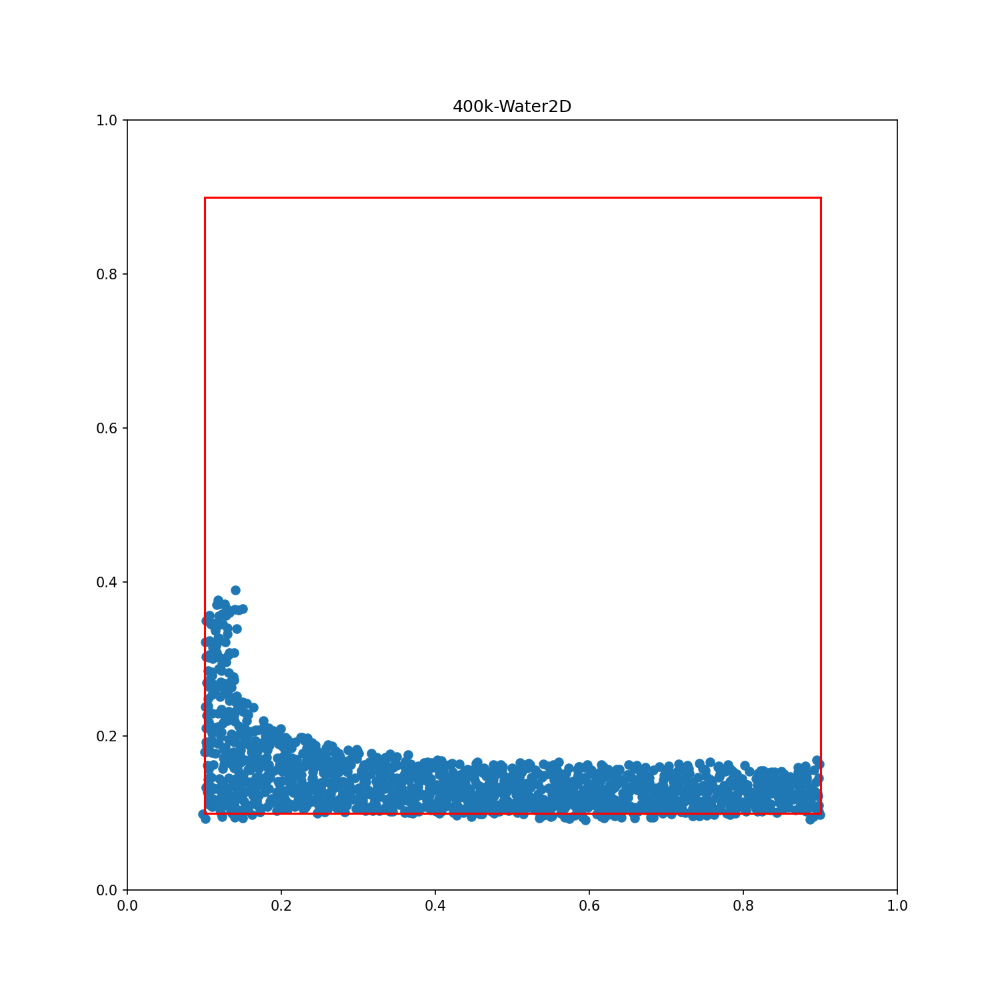
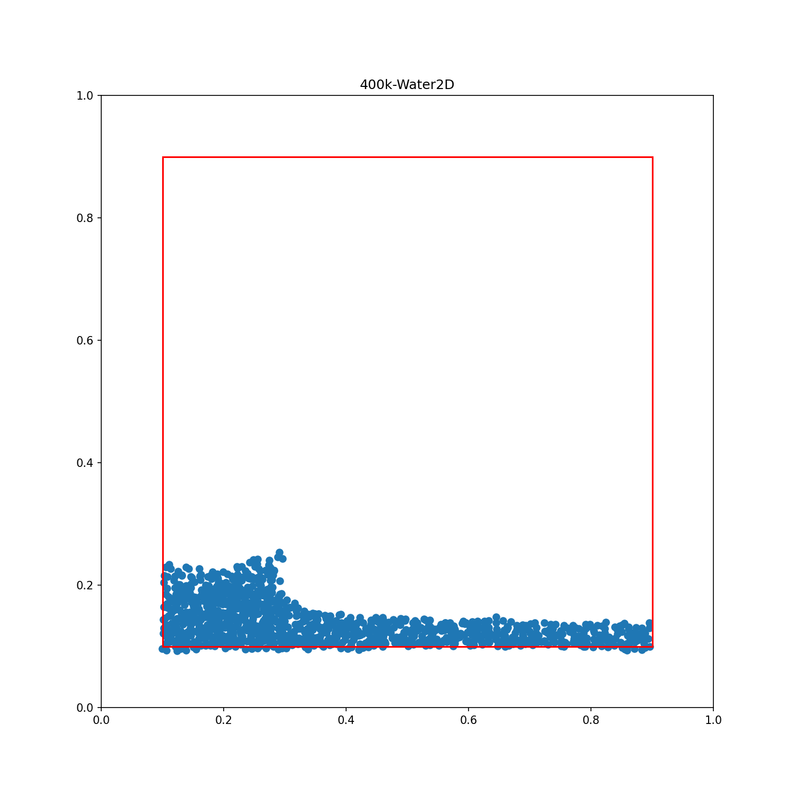
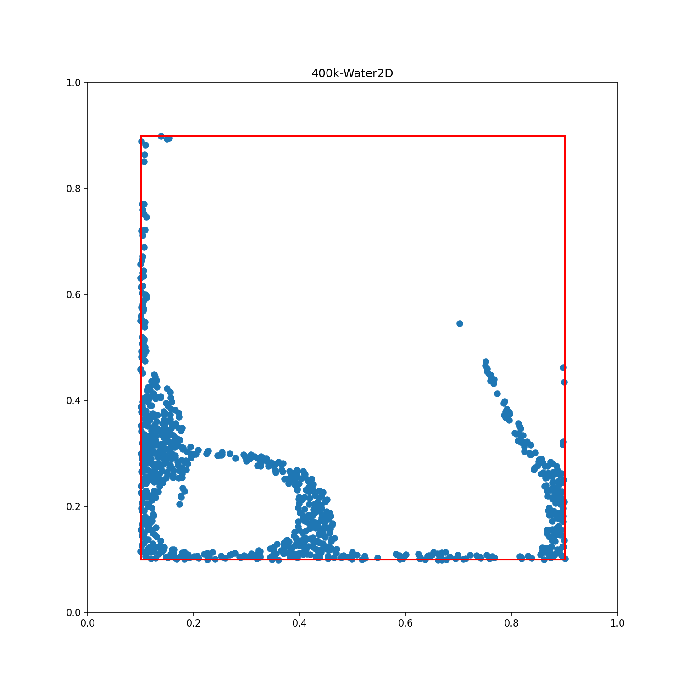

## Differentiable physics simulation with graph neural networks

This is an implementation of [Learning to Simulate Complex Physics with Graph Networks](https://arxiv.org/abs/2002.09405), written in PyTorch. 

Currently, basic 2D simulation works fairly well. I haven't had the time to train the model for more than 400k epochs, so the current results are not as polished as they would be when the network is trained to 20M epochs. Here's a few examples of the network's predictions after being given an initial position and five previous velocities:

As you can see, by this point the network has not fully learned to respect boundaries, and for some reason particles that are far away from others fly off in weird directions (it may be due to the network getting little experience with particles that have no edges connected to them). However, it has the right idea and most of the simulations look plausible.

I anticipate that the network will likely work with 3D datasets without any modification, but training such a network requires more VRAM than a tesla v100 or RTX 3090, the GPUs I have access to, have. I do have plans to train this on a TPU at some point. I will release more GIFs once I have the time to train a 10M epoch network on more than just the 2d water dataset (I haven't set up the particle embeddings yet).

Get started by running `python -m graph_nn_physics -h` to train, and `python -m visualize.{ learned | edges | dataset }` for various visualizations of the dataset and inferred data.
